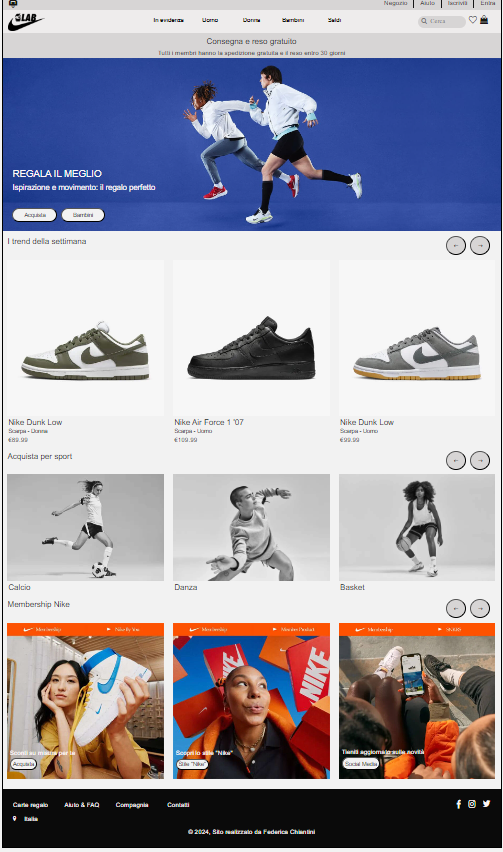
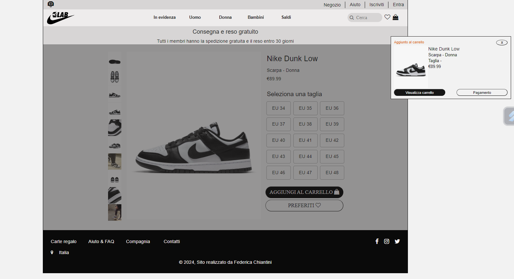
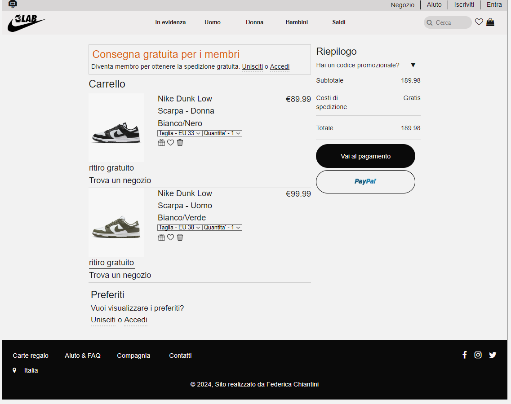
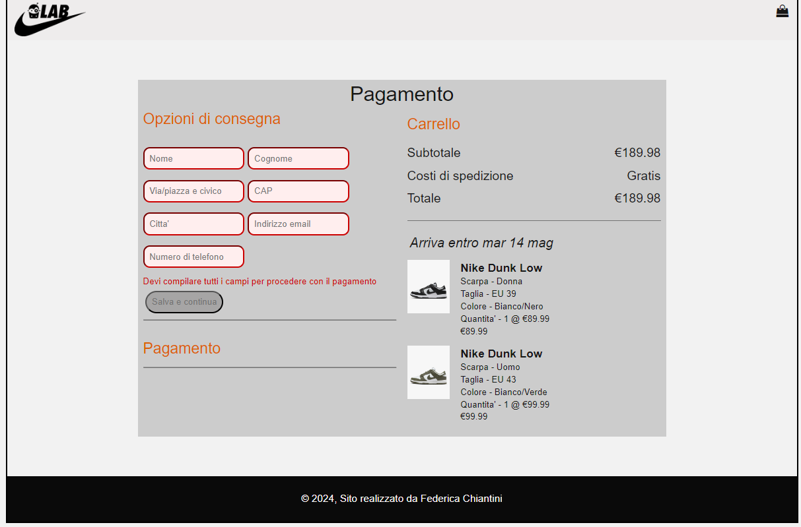

🇮🇹 ITALIAN: Progetto di meta' percorso realizzato in circa 2 mesi, organizzato in 5 pagine (homepage, le pagine delle due scarpe, pagina del carrello e del pagamento). Si compone di un file css realizzato con SASS
per la gran parte del progetto e delle logiche del carousel, del aggiunta e controllo dei prodotti nel carrello, del controllo e validazione del form nel file di Javascript.
Progetto realizzato dopo il corso di base di HTML,CSS e Javascript e durante il corso di Responsive web design e Javascript avanzato.
VOTO FINALE: 30/30

🇬🇧 ENGLISH:cMid-course project that I have completed in about 2 months, organized in 5 pages (homepage, the pages of the two shoes models, cart and payment page). It consists of a css file made with SASS for most 
of the project and the logic of the carousel, the addition and control of the products in the cart, the control and validation of the form in the Javascript file.
Project realized after the beginner course of HTML, CSS and Javascript and during the course of Responsive web design and Javascript Advanced.
FINAL SCORE: 30/30

Immagini di come dovrebbero apparire le pagine aperte sul browser

